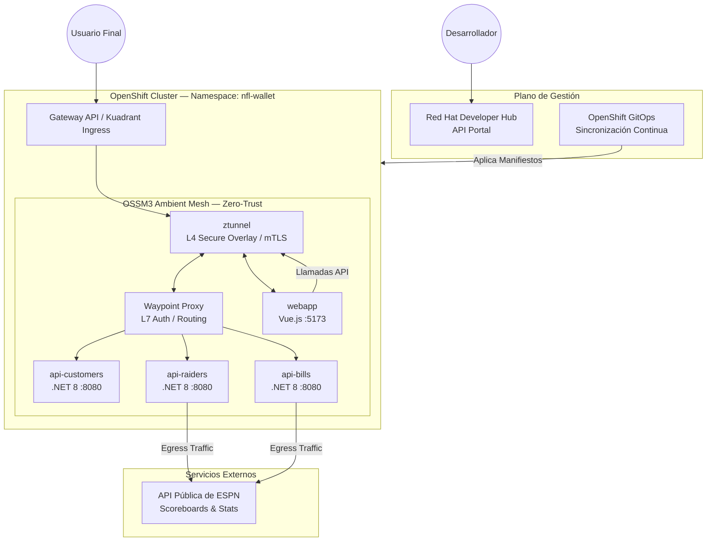
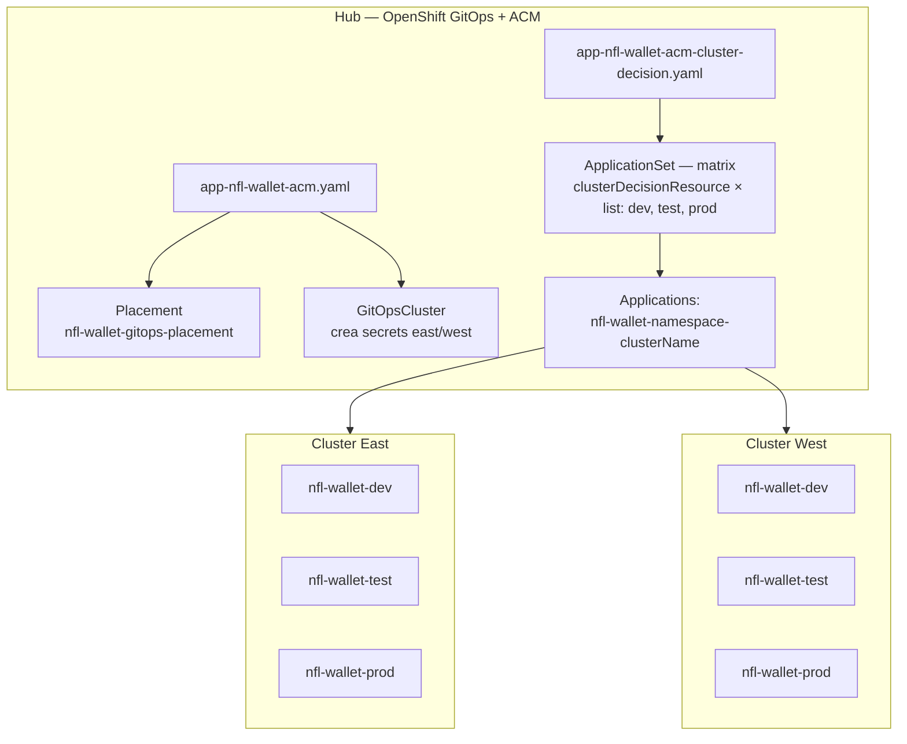
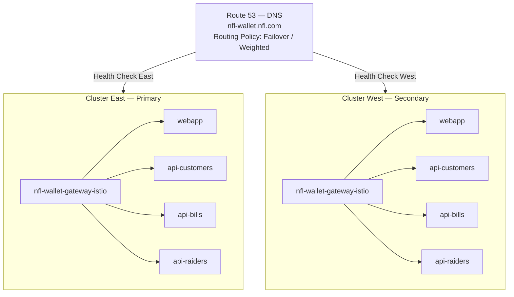
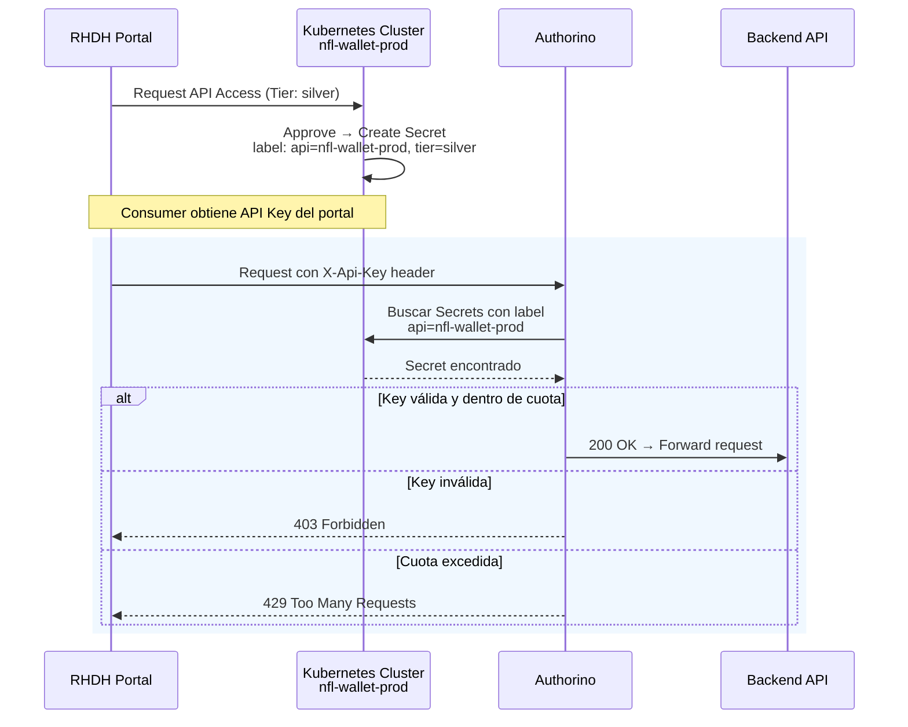

<section class="hero-section">
  <div class="hero-badge-row">
    
    
    
    
    
    
  </div>
  <h1>NFL Stadium <span>Wallet</span></h1>
  <p class="hero-sub">Guía Oficial de Instalación, Pruebas y Arquitectura — Ecosistema completo de billetera digital para estadios de la NFL sobre Red Hat OpenShift.</p>
  <p class="hero-meta"><strong>Versión:</strong> 2.0 &nbsp;|&nbsp; <strong>Owner:</strong> Maximiliano Pizarro &nbsp;|&nbsp; <strong>Infra & Service Mesh:</strong> <a href="https://github.com/panchoraposo">Francisco Raposo</a></p>
</section>

<div class="toc" markdown="0">
  <h3>Tabla de Contenidos</h3>
  <ol>
    <li><a href="#resumen-ejecutivo">Resumen Ejecutivo</a></li>
    <li><a href="#arquitectura">Arquitectura y Flujos de Datos</a></li>
    <li><a href="#stack-tecnológico">Stack Tecnológico</a></li>
    <li><a href="#prerrequisitos">Prerrequisitos de Infraestructura</a></li>
    <li><a href="#despliegue">Guía de Instalación GitOps</a></li>
    <li><a href="#service-mesh">Service Mesh 3 (Ambient Mode)</a></li>
    <li><a href="#connectivity-link">Connectivity Link y Gateway API</a></li>
    <li><a href="#seguridad">Seguridad: API Keys y Políticas</a>
      <ul>
        <li><a href="#namespace-isolation">Restricción entre Namespaces (Test/Prod)</a></li>
        <li><a href="#gateway-namespace-policies">Políticas entre Namespaces con Gateway API e Istio</a></li>
        <li><a href="#dns-failover">Failover con DNSPolicy y Route 53</a></li>
      </ul>
    </li>
    <li><a href="#gitops">GitOps Multi-Cluster con ACM</a></li>
    <li><a href="#developer-hub">Red Hat Developer Hub (Kuadrant Plugin)</a></li>
    <li><a href="#observabilidad">Observabilidad</a></li>
    <li><a href="#capturas">Capturas de Pantalla</a></li>
    <li><a href="#canary">Canary / Blue-Green Deployments</a></li>
    <li><a href="#pruebas">Plan de Pruebas y Validación (QA)</a></li>
    <li><a href="#api-reference">Referencia de API</a></li>
    <li><a href="#troubleshooting">Troubleshooting</a></li>
    <li><a href="#artifact-hub">Publicar en Artifact Hub</a></li>
  </ol>
</div>

---

# 1. Resumen Ejecutivo {#resumen-ejecutivo}

[]({{ '/images/high-level-architecture.png' | relative_url }}){: .doc-img-link}
<span class="img-caption">Arquitectura de alto nivel del ecosistema NFL Wallet.</span>

Este documento proporciona la guía definitiva para el despliegue, configuración y validación del ecosistema **NFL Stadium Wallet**. La plataforma adopta un enfoque moderno basado en **GitOps**, seguridad **Zero-Trust** sin sidecars mediante **OSSM3 (Ambient Mode)**, y una gestión integral del ciclo de vida de las APIs a través de **Kuadrant** y **Red Hat Developer Hub**.

El sistema se compone de un **frontend interactivo** (Vue.js) y **tres microservicios core** (.NET 8):

| Microservicio | Función |
|---------------|---------|
| **api-customers** | Gestión centralizada de identidad y perfiles de clientes |
| **api-bills** | Lógica transaccional para el venue de Buffalo Bills |
| **api-raiders** | Lógica transaccional para el venue de Las Vegas Raiders |

Los microservicios interactúan con fuentes de datos externas (**API de ESPN**) de forma segura y auditable para obtener datos deportivos en tiempo real.

<div class="section-cards">
  <div class="section-card">
    <span class="card-icon">&#9881;</span>
    <h4>GitOps Declarativo</h4>
    <p>Sincronización continua con OpenShift GitOps (ArgoCD) — todo el estado se define en Git.</p>
  </div>
  <div class="section-card">
    <span class="card-icon">&#128274;</span>
    <h4>Zero-Trust sin Sidecars</h4>
    <p>OSSM3 Ambient Mode: mTLS automático, sin inyección de contenedores sidecar.</p>
  </div>
  <div class="section-card">
    <span class="card-icon">&#128200;</span>
    <h4>Observabilidad Completa</h4>
    <p>Grafana, Prometheus, Kiali, TempoStack y OpenTelemetry para visibilidad total.</p>
  </div>
  <div class="section-card">
    <span class="card-icon">&#127758;</span>
    <h4>Multi-Cluster Federado</h4>
    <p>Topología Hub-and-Spoke con ACM, desplegado en clústeres East y West.</p>
  </div>
</div>

### Recursos Relacionados

| Recurso | Descripción |
|---------|-------------|
| [Build a zero trust environment with Red Hat Connectivity Link](https://developers.redhat.com/articles/2026/02/12/build-zero-trust-environment-red-hat-connectivity-link) | Artículo en Red Hat Developer: arquitectura Zero Trust con OIDC/Keycloak y NeuralBank |
| [Red Hat Connectivity Link — Documentación v1.2](https://docs.redhat.com/en/documentation/red_hat_connectivity_link/1.2) | Documentación oficial del producto |
| [Red Hat Connectivity Link — Producto](https://www.redhat.com/en/technologies/cloud-computing/connectivity-link) | Página de producto con overview y casos de uso |
| [Kuadrant — Documentación](https://docs.kuadrant.io/) | Documentación del proyecto upstream (AuthPolicy, RateLimitPolicy, DNSPolicy) |
| [Kuadrant — Proyecto](https://kuadrant.io/) | Sitio del proyecto open source |
| [Getting Started with Connectivity Link on OpenShift](https://developers.redhat.com/articles/2024/06/12/getting-started-red-hat-connectivity-link-openshift) | Guía de inicio rápido en Red Hat Developer |
| [OSSM3 Ambient Mode — Multi-Cluster Demo](https://github.com/panchoraposo/ossm3-ambient-mode) | Repo de Francisco Raposo: Ansible playbooks para OSSM3, Bookinfo y observabilidad multi-cluster |

---

# 2. Arquitectura y Flujos de Datos {#arquitectura}

## 2.1 Arquitectura de Tres Capas

La solución se estructura en un modelo moderno de tres capas:

| Capa | Componente | Stack Tecnológico | Función | Escalabilidad |
|------|------------|-------------------|---------|---------------|
| **Frontend** | webapp (SPA) | Vue 3, Vite, vue-router, Apache (UBI8 httpd-24) | UI para login, consulta de saldos y generación de QR para pagos | Stateless — HPA de OpenShift |
| **Backend API** | 3 Microservicios independientes | .NET 8.0 ASP.NET Core | ApiCustomers (identidad), ApiWalletBuffaloBills (transacciones Bills), ApiWalletLasVegasRaiders (transacciones Raiders) | Independientemente desplegables y escalables |
| **Datos** | Almacenamiento persistente | SQLite (customers.db, buffalobills.db, lasvegasraiders.db) | Persistencia local por cada API | Aislamiento estricto de datos |

> **Nota de producción:** Para despliegues productivos completos, las bases de datos SQLite deberían migrarse a soluciones de alta disponibilidad como PostgreSQL sobre OpenShift, potencialmente usando el operador Crunchy Data.

## 2.2 Diagrama de Arquitectura de Red y Service Mesh



## 2.3 Topología Multi-Cluster y Federación

El sistema utiliza un modelo **Hub-and-Spoke**, gobernado por las herramientas de plataforma y gestión de Red Hat:

- **Hub Cluster (Control Plane):** Red Hat Advanced Cluster Management (ACM), OpenShift GitOps (ArgoCD), Hub de Observabilidad centralizado (Prometheus, Grafana, Kiali).
- **Data Clusters East/West (Spoke):** Cargas de trabajo de la aplicación, OSSM3 en Ambient Mode, federación mediante HBONE (HTTP/2-Based Encryption).



## 2.4 Integración con API ESPN

Los microservicios `api-bills` y `api-raiders` requieren datos deportivos en tiempo real.

- **Endpoint:** `https://site.api.espn.com/apis/site/v2/sports/football/nfl/scoreboard`
- **Gestión de Egress:** OSSM3 Ambient Mode intercepta las peticiones HTTP salientes mediante el ztunnel del nodo, permitiendo monitorizar latencias y aplicar políticas de salida sin la penalización de rendimiento de inyectar contenedores sidecar.

---

# 3. Stack Tecnológico {#stack-tecnológico}

<div class="tech-badges">
  
  
  
  
  
  
  
  
</div>

| Componente | Tecnología | Propósito |
|------------|------------|-----------|
| **Frontend** | Vue 3, Vite, vue-router | SPA servida por Apache (UBI8) |
| **Backend** | .NET 8.0 ASP.NET Core (x3) | Microservicios: Customers, Bills, Raiders |
| **Datos** | SQLite | Una base de datos por API |
| **Contenedores** | Podman / OpenShift | Build e imágenes en Quay.io |
| **Orquestación** | OpenShift 4.20+, Kubernetes | Plataforma de contenedores |
| **GitOps** | OpenShift GitOps (ArgoCD) | Sincronización declarativa |
| **Service Mesh** | OSSM 3.2 (Sail Operator, Ambient Mode) | Zero-Trust, mTLS, L7 routing |
| **Gateway** | Gateway API, Kuadrant | Ingress, Rate Limiting, Auth |
| **Observabilidad** | Prometheus, Grafana, Kiali, TempoStack, OpenTelemetry | Métricas, trazas, topología |
| **Multi-Cluster** | ACM (Advanced Cluster Management) | Hub-and-Spoke, federación |
| **Developer Portal** | Red Hat Developer Hub (RHDH) | Catálogo de APIs, autoservicio |

---

# 4. Prerrequisitos de Infraestructura {#prerrequisitos}

## 4.1 Requisitos del Clúster

| Requisito | Detalle | Justificación |
|-----------|---------|---------------|
| **OpenShift Container Platform** | Versión 4.20 o superior, con privilegios cluster-admin | Compatibilidad con OSSM 3.2 y las últimas políticas de Kuadrant |
| **Topología** | Mínimo tres clústeres: Hub (ACM/GitOps), East (Workloads), West (Workloads) | Validar la federación multi-cluster |
| **SNO (Single Node OpenShift)** | Si se usa para PoC, aumentar `maxPods` (recomendado: 500 mínimo) | Soportar la carga del Service Mesh y Kuadrant |

## 4.2 Operadores Requeridos

Los siguientes operadores deben estar instalados y configurados por el administrador (Cluster Admin):

1. **OpenShift GitOps** — Sincronización declarativa del repositorio
2. **OpenShift Service Mesh 3 (Sail Operator)** — Plano de control de Istio Ambient Mode
3. **Gateway API Operator** — Enrutamiento y exposición de servicios
4. **Kuadrant Operator** — Rate Limiting y Auth Policies
5. **Red Hat Developer Hub (RHDH)** — Portal de APIs con plugin de Kuadrant

## 4.3 Herramientas Locales

| Herramienta | Uso |
|-------------|-----|
| `oc` CLI | Login en los tres contextos de clúster |
| .NET 8.0 SDK + Node.js 20 | Desarrollo local y validación pre-deploy |
| Podman | Build, gestión y testing local de imágenes UBI8 |
| Ansible | Ejecución de playbooks de inicialización multi-cluster |
| Helm 3 | Despliegue del chart `nfl-wallet` |

---

# 5. Guía de Instalación GitOps {#despliegue}

### Por qué GitOps

NFL Wallet adopta GitOps como modelo de despliegue porque resuelve problemas fundamentales de la operación de plataformas:

- **Reproducibilidad:** El estado completo del clúster está declarado en Git. Cualquier ambiente (dev, test, prod) se puede recrear desde cero aplicando los mismos manifiestos
- **Auditabilidad:** Cada cambio en la infraestructura tiene un commit con autor, fecha y mensaje. No hay "cambios a mano" que se pierden — Git es la fuente de verdad
- **Drift detection:** ArgoCD compara continuamente el estado deseado (Git) contra el estado real (clúster) y alerta o autocorrige desviaciones
- **Rollback declarativo:** Revertir un despliegue problemático es un `git revert` — ArgoCD reconcilia automáticamente al estado anterior

> *"Rather than manually configuring each component, you define the desired state in code, and GitOps ensures that state is achieved and maintained."* — [Build a zero trust environment with Red Hat Connectivity Link](https://developers.redhat.com/articles/2026/02/12/build-zero-trust-environment-red-hat-connectivity-link)

La instalación se realiza de forma **declarativa** mediante OpenShift GitOps (ArgoCD), no mediante comandos imperativos.

## 5.1 Ejecución Local con Podman Compose

Para desarrollo local, el stack completo se ejecuta con **Podman Compose**:

```bash
# Desde la raíz del repositorio
podman-compose up -d --build

# Acceder a la aplicación
# http://localhost:5160
```

Servicios locales:
- **api-customers** — Puerto 5001
- **api-buffalo-bills** — Puerto 5002
- **api-las-vegas-raiders** — Puerto 5003
- **webapp** — Puerto 5160

[]({{ '/images/podman.png' | relative_url }}){: .doc-img-link}
<span class="img-caption">Ejecución del stack con Podman Compose: webapp y tres APIs en contenedores locales.</span>

## 5.2 Desarrollo con Red Hat OpenShift Dev Spaces

El repositorio incluye un **devfile.yaml** para Red Hat OpenShift Dev Spaces, permitiendo desarrollar y testear en un IDE cloud sin instalar .NET ni Node.js localmente.

[]({{ '/images/devspaces.png' | relative_url }}){: .doc-img-link}
<span class="img-caption">Workspace de OpenShift Dev Spaces con el proyecto NFL-Wallet.</span>

[]({{ '/images/devspaces2.png' | relative_url }}){: .doc-img-link}
<span class="img-caption">Build y ejecución en Dev Spaces: compilar e iniciar la webapp y las APIs desde el workspace.</span>

[]({{ '/images/devspaces3.png' | relative_url }}){: .doc-img-link}
<span class="img-caption">Aplicación ejecutándose desde Dev Spaces: frontend y APIs servidos desde la nube.</span>

## 5.3 Despliegue con Helm Chart

```bash
kubectl create namespace nfl-wallet

helm install nfl-wallet ./helm/nfl-wallet -n nfl-wallet
```

### Valores del Chart (Referencia)

| Clave | Descripción | Default |
|-------|-------------|---------|
| `global.imageRegistry` | Registro de imágenes | `quay.io` |
| `imageNamespace` | Namespace del registro | `maximilianopizarro` |
| `apiCustomers.service.port` | Puerto del servicio | `8080` |
| `apiBills.service.port` | Puerto del servicio | `8081` |
| `apiRaiders.service.port` | Puerto del servicio | `8082` |
| `webapp.service.port` | Puerto del servicio | `5173` |
| `webapp.route.enabled` | Crear Route de OpenShift | `true` |
| `gateway.enabled` | Crear Gateway + HTTPRoutes | `false` |
| `gateway.className` | GatewayClass | `istio` |
| `apiKeys.enabled` | Crear Secret e inyectar API keys | `false` |
| `authorizationPolicy.enabled` | Istio AuthorizationPolicy para X-API-Key | `false` |
| `observability.rhobs.enabled` | Recursos RHOBS (ThanosQuerier, PodMonitor, UIPlugin) | `false` |

## 5.4 Aplicar la Application Root de ArgoCD

```yaml
apiVersion: argoproj.io/v1alpha1
kind: Application
metadata:
  name: nfl-wallet-production
  namespace: openshift-gitops
spec:
  project: default
  source:
    repoURL: 'https://github.com/maximilianopizarro/nfl-wallet-gitops.git'
    targetRevision: HEAD
    path: helm/nfl-wallet
  destination:
    server: 'https://kubernetes.default.svc'
    namespace: nfl-wallet
  syncPolicy:
    automated:
      prune: true
      selfHeal: true
    syncOptions:
      - CreateNamespace=true
```

> Una vez aplicado, ArgoCD desplegará los Deployments, Services, HTTPRoutes, y las políticas de Kuadrant de forma ordenada.

[]({{ '/images/topology.png' | relative_url }}){: .doc-img-link}
<span class="img-caption">Vista de topología en OpenShift: webapp → api-customers, api-bills, api-raiders.</span>

---

# 6. Service Mesh 3 (Ambient Mode) {#service-mesh}

OpenShift Service Mesh 3 (OSSM3) implementa un modelo de seguridad **Zero Trust** en la capa de red: cada conexión entre servicios se autentica y encripta automáticamente mediante mTLS, independientemente de su origen. El principio es *"nunca confiar, siempre verificar"* — ningún servicio puede comunicarse con otro sin presentar una identidad criptográfica válida emitida por la CA del mesh. Esto elimina la confianza implícita basada en la topología de red y proporciona defensa en profundidad contra movimiento lateral.

> **Lectura relacionada:** El artículo [Build a zero trust environment with Red Hat Connectivity Link](https://developers.redhat.com/articles/2026/02/12/build-zero-trust-environment-red-hat-connectivity-link) profundiza en la integración de Service Mesh con Connectivity Link y Kuadrant para construir una arquitectura Zero Trust completa.

## 6.1 Modelo de Seguridad Zero-Sidecar

OSSM 3.2 en Ambient Mode separa las funciones de seguridad L4 y L7 en componentes especializados:

| Componente | Capa | Función |
|------------|------|---------|
| **ztunnel** | L4 | Seguridad a nivel de nodo: mTLS para todo el tráfico East-West, telemetría L4, encriptación de transporte |
| **Waypoint Proxy** | L7 | Proxy Envoy dedicado por servicio: telemetría avanzada L7, routing HTTP complejo, control de acceso |

Los Waypoints se despliegan estratégicamente para `api-customers`, `api-bills` y `api-raiders` sin inyectar sidecars en los pods.

### Sidecar tradicional vs. Ambient Mode

En el modelo **sidecar tradicional**, cada pod recibe un contenedor `istio-proxy` inyectado automáticamente. Esto implica duplicar el consumo de memoria y CPU por cada workload, incrementar la latencia de startup, y complicar el debugging (cada pod tiene 2+ contenedores).

**Ambient Mode** elimina esta complejidad separando las responsabilidades:

| Aspecto | Sidecar | Ambient |
|---------|---------|---------|
| mTLS | Proxy por pod | ztunnel por nodo (DaemonSet) |
| Contenedores por pod | 2+ (app + sidecar) | 1 (solo app) |
| Overhead de memoria | ~50-100 MB por sidecar | Compartido por nodo |
| Políticas L7 | Sidecar Envoy | Waypoint Proxy (opcional, por servicio) |
| Complejidad operativa | Alta (inyección, disruptions en rollouts) | Baja (sin inyección, sin disruptions) |

El resultado es la **misma seguridad mTLS** con menor overhead de recursos y menor complejidad operativa.

### Impacto real en recursos

Los datos publicados por la comunidad Istio muestran el ahorro concreto que Ambient Mode aporta a escala:

> *"Ambient mode's shared ztunnel uses about 1 GB of memory for 300 pods on 10 nodes. By contrast, sidecar mode deploys a proxy per pod, consuming approximately 21 GB of memory for the same 300 pods."*

Esto representa una **reducción de ~95 % en consumo de memoria** dedicada al mesh. Además, como ztunnel opera como DaemonSet (un proceso por nodo), el overhead no crece con el número de pods sino con el de nodos, haciendo Ambient Mode particularmente eficiente para plataformas con alta densidad de microservicios.

| Métrica | Sidecar (300 pods / 10 nodos) | Ambient (300 pods / 10 nodos) |
|---------|-------------------------------|-------------------------------|
| Memoria del mesh | ~21 GB | ~1 GB |
| Proxies desplegados | 300 (uno por pod) | 10 ztunnels + waypoints selectivos |
| Startup latency adicional | Sí (inyección de sidecar) | No |

> **Fuente:** [Istio — Ambient Mode Overview](https://istio.io/latest/docs/overview/dataplane-modes/) · *"Start with L4 security and selectively add L7 features only to services that need them."*

## 6.2 Enrolamiento en Ambient Mode

El namespace se inscribe en la malla mediante una etiqueta, aplicada automáticamente por ArgoCD:

```yaml
apiVersion: v1
kind: Namespace
metadata:
  name: nfl-wallet
  labels:
    istio.io/dataplane-mode: ambient
```

**Validación:** Los pods de la aplicación NO tienen el contenedor `istio-proxy`, pero el tráfico se encripta mediante mTLS gestionado por el DaemonSet ztunnel.

Verificar que ztunnel está interceptando el tráfico del namespace:

```bash
# Confirmar que los pods NO tienen sidecar (1/1 containers)
oc get pods -n nfl-wallet -o custom-columns=NAME:.metadata.name,CONTAINERS:.spec.containers[*].name,READY:.status.containerStatuses[*].ready

# Verificar que ztunnel está activo y procesando tráfico
oc logs -n ztunnel -l app=ztunnel --tail=20 | grep "nfl-wallet"

# Confirmar identidad SPIFFE asignada a los workloads
oc exec -n ztunnel $(oc get pod -n ztunnel -l app=ztunnel -o name | head -1) -- curl -s localhost:15000/config_dump | grep "nfl-wallet"
```

## 6.3 Waypoint Proxy

El Waypoint Proxy se despliega solo cuando se requieren políticas L7 (HTTP routing, AuthPolicy, telemetría avanzada). Si un servicio solo necesita mTLS (L4), **ztunnel es suficiente** y no se requiere Waypoint — esto reduce el consumo de recursos.

**Cuándo usar cada componente:**

| Necesidad | Componente | Ejemplo en NFL Wallet |
|-----------|------------|----------------------|
| mTLS + telemetría básica | ztunnel (L4) | Comunicación webapp ↔ apis |
| AuthPolicy / RateLimitPolicy | Waypoint (L7) | Validación de API Key en api-customers |
| Routing HTTP avanzado | Waypoint (L7) | URL rewrite en HTTPRoutes |
| Trazas distribuidas (spans L7) | Waypoint (L7) | Spans en Jaeger/Tempo |

El Waypoint se integra nativamente con las políticas de [Kuadrant](https://docs.kuadrant.io/): cuando una AuthPolicy o RateLimitPolicy referencia un HTTPRoute, el Waypoint es el componente que ejecuta la validación L7 en coordinación con Authorino y Limitador.

```yaml
apiVersion: gateway.networking.k8s.io/v1
kind: Gateway
metadata:
  name: nfl-wallet-waypoint
  namespace: nfl-wallet
  labels:
    istio.io/waypoint-for: service
spec:
  gatewayClassName: istio-waypoint
  listeners:
  - name: mesh
    port: 15008
    protocol: HBONE
```

## 6.4 Federación y Trust

La federación multi-cluster establece un dominio de confianza unificado entre los clústeres East y West. El proceso se basa en tres pilares:

- **Shared Root CA:** Una CA raíz compartida entre todos los Data Clusters (East/West). Cada clúster genera certificados intermedios desde esta CA, permitiendo que las identidades SPIFFE (`spiffe://cluster.local/ns/nfl-wallet/sa/api-customers`) sean reconocidas por ambos clústeres
- **meshNetworks:** Configuración de reachabilidad cross-cluster que define qué redes son alcanzables y a través de qué gateways
- **East-West HBONE Gateways:** Transporte L4 seguro mediante HBONE para descubrimiento y comunicación entre regiones. El protocolo HBONE encapsula tráfico mTLS sobre HTTP/2 CONNECT, atravesando firewalls y load balancers sin requerir puertos adicionales

> **Referencia:** El repo [ossm3-ambient-mode](https://github.com/panchoraposo/ossm3-ambient-mode) contiene los scripts de Ansible para automatizar la generación de la CA compartida, el intercambio de remote secrets y la configuración de meshNetworks entre clústeres.

---

# 7. Connectivity Link y Gateway API {#connectivity-link}

[Red Hat Connectivity Link](https://www.redhat.com/en/technologies/cloud-computing/connectivity-link) es un framework Kubernetes-native que unifica **Gateway API**, **gestión de políticas** (autenticación, rate limiting) y **DNS** en una experiencia declarativa. Basado en el proyecto upstream [Kuadrant](https://kuadrant.io/), Connectivity Link permite definir políticas de conectividad como CRDs que se aplican automáticamente al Gateway, eliminando la necesidad de configurar proxies, rate limiters y auth servers de forma manual.

En el contexto de NFL Wallet, Connectivity Link orquesta:
- **Ingress** via Kubernetes Gateway API (reemplazando OpenShift Routes tradicionales)
- **Rate Limiting** via RateLimitPolicy + [Limitador](https://docs.kuadrant.io/) (motor de cuotas escrito en Rust)
- **Autenticación** via AuthPolicy + [Authorino](https://docs.kuadrant.io/latest/authorino/docs/getting-started/) (validación de API Keys)
- **DNS** via DNSPolicy para failover multi-cluster con Route 53

> **Documentación oficial:**
> - [Red Hat Connectivity Link v1.2](https://docs.redhat.com/en/documentation/red_hat_connectivity_link/1.2)
> - [Kuadrant — Documentación](https://docs.kuadrant.io/)
> - [Getting Started with Connectivity Link on OpenShift](https://developers.redhat.com/articles/2024/06/12/getting-started-red-hat-connectivity-link-openshift)

### Por qué Gateway API y no Ingress tradicional

La migración de Ingress a Gateway API no es una decisión estética — es una necesidad operativa con un horizonte concreto:

- **Ingress NGINX alcanza fin de soporte en marzo 2026.** Los proyectos que dependan de este controlador deberán migrar a alternativas activamente mantenidas. Gateway API es la recomendación oficial del proyecto Kubernetes.
- **Gateway API alcanzó GA en octubre 2023** (v1.0) y ya es soportada por todos los controladores principales: Istio, Envoy Gateway, HAProxy, Traefik, NGINX Gateway Fabric y Cilium.
- **Las annotations vendor-specific de Ingress** (como `nginx.ingress.kubernetes.io/*`) generan lock-in al controlador. Gateway API usa CRDs tipados con validación en esquema — no hay magic annotations.

> *"Kuadrant extends Gateway API to add a connectivity management API that makes it easy for platform engineers and application developers to collaborate on connectivity concerns."* — [kuadrant.io](https://kuadrant.io/)

La ventaja fundamental de Gateway API es la **separación de responsabilidades** mediante CRDs formales: el equipo de plataforma controla el `Gateway`, los equipos de desarrollo controlan sus `HTTPRoute`, y las políticas de seguridad se aplican como attachments independientes. Esto elimina la necesidad de coordinar annotations en un único recurso Ingress compartido.

> **Fuentes:** [Kubernetes Gateway API](https://gateway-api.sigs.k8s.io/) · [Introducing ingress2gateway](https://kubernetes.io/blog/2023/10/25/introducing-ingress2gateway/) · [Red Hat Connectivity Link — Now GA](https://developers.redhat.com/articles/2025/01/23/red-hat-connectivity-link-now-generally-available)

## 7.1 Ingress con HTTPRoute

La [Kubernetes Gateway API](https://gateway-api.sigs.k8s.io/) es el estándar que reemplaza al recurso Ingress tradicional. Su principal ventaja es la **separación de responsabilidades**: el equipo de infraestructura define el recurso `Gateway` (listeners, protocolos, certificados), mientras que los equipos de desarrollo definen sus propios `HTTPRoute` (paths, backends, rewrites). Esta separación se formaliza mediante los CRDs:

| CRD | Responsable | Función |
|-----|-------------|---------|
| `GatewayClass` | Proveedor (Istio/Envoy) | Define el controlador que implementa el Gateway |
| `Gateway` | Platform Engineer | Listeners (puertos, protocolos, TLS), políticas globales |
| `HTTPRoute` | Developer | Routing por path/header, backends, URL rewrite |
| `ReferenceGrant` | Platform Engineer | Autoriza referencias cross-namespace |

```yaml
apiVersion: gateway.networking.k8s.io/v1
kind: HTTPRoute
metadata:
  name: nfl-wallet-frontend
spec:
  parentRefs:
  - name: nfl-gateway
  rules:
  - matches:
    - path:
        type: PathPrefix
        value: /
    backendRefs:
    - name: webapp
      port: 5173
```

Se crean cuatro HTTPRoutes: webapp (`/`), api-customers (`/api-customers`), api-bills (`/api-bills`), api-raiders (`/api-raiders`), con URL rewrite al backend.

## 7.2 Habilitar Gateway

El Gateway define los listeners que aceptan tráfico externo. En NFL Wallet, el Helm chart crea un Gateway con listener HTTP que es gestionado por el controlador Istio/Envoy de Connectivity Link:

```yaml
apiVersion: gateway.networking.k8s.io/v1
kind: Gateway
metadata:
  name: nfl-wallet-gateway
  namespace: nfl-wallet
spec:
  gatewayClassName: openshift-gateway
  listeners:
  - name: http
    port: 8080
    protocol: HTTP
    allowedRoutes:
      namespaces:
        from: Same
```

Despliegue via Helm:

```bash
helm install nfl-wallet ./helm/nfl-wallet -n nfl-wallet \
  --set gateway.enabled=true \
  --set gateway.className=openshift-gateway
```

## 7.3 Rate Limiting con Kuadrant

Kuadrant implementa rate limiting mediante dos componentes: la **RateLimitPolicy** (CRD declarativo que define las reglas) y **Limitador** (servicio que mantiene los contadores en memoria y evalúa las cuotas). El flujo de enforcement es:

1. Un request llega al **Gateway** (Envoy)
2. Envoy consulta a **Limitador** con los descriptores definidos en la RateLimitPolicy
3. Limitador evalúa los contadores (ventana de tiempo + límite) y responde allow/deny
4. Si el límite se excede, el Gateway retorna **429 Too Many Requests** antes de que el request llegue al backend

```yaml
apiVersion: kuadrant.io/v1beta2
kind: RateLimitPolicy
metadata:
  name: api-customers-limit
spec:
  targetRef:
    group: gateway.networking.k8s.io
    kind: HTTPRoute
    name: api-customers-route
  limits:
    "customer-api-standard":
      rates:
      - limit: 100
        duration: 1
        unit: minute
```

### Tiers de Rate Limiting

NFL Wallet define tres tiers de acceso que se aplican mediante PlanPolicy en combinación con el plugin de Kuadrant en RHDH:

| Tier | Límite | Caso de Uso |
|------|--------|-------------|
| **Bronze** | 100 req/día | Evaluación y desarrollo |
| **Silver** | 500 req/día | Aplicaciones en testing |
| **Gold** | 1000 req/día | Producción |

Habilitar Rate Limiting + Auth:

```bash
helm upgrade nfl-wallet ./helm/nfl-wallet -n nfl-wallet \
  --set gateway.enabled=true \
  --set gateway.rateLimitPolicy.enabled=true \
  --set gateway.authPolicy.enabled=true \
  --set gateway.authPolicy.bills.enabled=true
```

[]({{ '/images/connectivity-link.png' | relative_url }}){: .doc-img-link}
<span class="img-caption">Connectivity Link: Gateway API y HTTPRoutes exponiendo webapp y APIs.</span>

[]({{ '/images/connectivity-link-auth.png' | relative_url }}){: .doc-img-link}
<span class="img-caption">Connectivity Link con Kuadrant AuthPolicy (X-API-Key) y RateLimitPolicy en /api-bills.</span>

---

# 8. Seguridad: API Keys y Políticas {#seguridad}

La seguridad en NFL Wallet se implementa en múltiples capas, siguiendo el principio de defensa en profundidad. El flujo end-to-end de un request autenticado es:

1. El request llega al **Gateway** (Envoy gestionado por Connectivity Link)
2. **Authorino** intercepta el request y busca credenciales: extrae el header `X-Api-Key` y lo compara contra los Secrets de Kubernetes que tienen el label `api: nfl-wallet-prod`
3. Si la credencial es válida, **OPA** evalúa las reglas Rego definidas en la AuthPolicy
4. **Limitador** verifica que el consumidor no haya excedido su cuota (según su Tier: bronze/silver/gold)
5. Si todas las validaciones pasan, el request se forwarded al backend con mTLS (ztunnel/Waypoint)
6. Si falla autenticación → **403 Forbidden**; si falla cuota → **429 Too Many Requests**

> **Modelos de autenticación soportados por Connectivity Link:** NFL Wallet utiliza **API Keys** como mecanismo de autenticación. Connectivity Link también soporta **OIDC/OAuth2** con proveedores como Red Hat build of Keycloak, como se demuestra en el artículo [Build a zero trust environment with Red Hat Connectivity Link](https://developers.redhat.com/articles/2026/02/12/build-zero-trust-environment-red-hat-connectivity-link) con la aplicación NeuralBank. Ambos modelos son complementarios y pueden coexistir en el mismo clúster.

## 8.1 Dos Modelos de Seguridad

| Modelo | Ubicación | CRD | Caso de Uso |
|--------|-----------|-----|-------------|
| **Istio AuthorizationPolicy** | Service Mesh (workload) | `security.istio.io/v1` | Validación directa en el pod |
| **AuthPolicy con Authorino** | Gateway (Kuadrant) | `kuadrant.io/v1` | Validación en el gateway con 403 personalizado |

## 8.2 AuthorizationPolicy de Istio

```yaml
apiVersion: security.istio.io/v1
kind: AuthorizationPolicy
metadata:
  name: api-raiders-require-apikey
spec:
  selector:
    matchLabels:
      app: api-raiders
  action: ALLOW
  rules:
    - when:
        - key: request.headers[x-api-key]
          values: ["*"]
```

## 8.3 AuthPolicy de Kuadrant (Gateway)

La [AuthPolicy](https://docs.kuadrant.io/) es el CRD de Kuadrant que define reglas de autenticación y autorización a nivel de Gateway o HTTPRoute. Internamente, Kuadrant delega la ejecución a **Authorino**, que actúa como servidor de autorización externo (ext-authz) integrado con Envoy.

**Cómo Authorino descubre credenciales:** Authorino busca Secrets de Kubernetes que contengan labels específicos (por ejemplo `api: nfl-wallet-prod`). Cuando un request incluye el header `X-Api-Key`, Authorino compara el valor contra todos los Secrets que matchean el label selector. Este mecanismo permite aprovisionar y revocar API Keys de forma dinámica sin reiniciar ningún componente — basta con crear o eliminar un Secret con el label correspondiente.

```yaml
apiVersion: kuadrant.io/v1
kind: AuthPolicy
metadata:
  name: nfl-wallet-api-bills-auth
spec:
  targetRef:
    group: gateway.networking.k8s.io
    kind: HTTPRoute
    name: nfl-wallet-api-bills
  rules:
    authorization:
      require-apikey:
        opa:
          rego: |
            allow = true {
              input.context.request.http.headers["x-api-key"] != ""
            }
    response:
      unauthorized:
        body:
          value: '{"error":"Forbidden","message":"Missing or invalid X-API-Key header."}'
        headers:
          content-type:
            value: application/json
```

## 8.4 Seguridad por Ambiente

NFL Wallet implementa una **estrategia de seguridad progresiva** donde cada ambiente incrementa el nivel de protección. Esto permite iteración rápida en desarrollo, validación de integración en test, y Zero Trust completo en producción:

| Ambiente | API Key | AuthPolicy | Modelo de Mesh |
|----------|---------|------------|----------------|
| **Dev** | No requerida | Sin autenticación | Sidecar mode (`istio-injection: enabled`) |
| **Test** | `nfl-wallet-customers-key` | AuthPolicy + API keys | Ambient mode (`istio.io/dataplane-mode: ambient`) |
| **Prod** | `nfl-wallet-customers-key` | AuthPolicy + API keys + canary route | Ambient mode + Waypoint proxies |

- **Dev sin auth** permite a los desarrolladores iterar rápidamente sin gestionar credenciales, enfocándose en la lógica de negocio
- **Test con auth** valida que la integración con Authorino y las API Keys funciona correctamente antes de llegar a producción
- **Prod con auth + canary + ambient** garantiza Zero Trust completo: mTLS en todo el tráfico inter-servicio, validación de credenciales en el Gateway, rate limiting por Tier, y capacidad de despliegue canary para rollouts seguros

## 8.5 Restricción de Acceso entre Namespaces (Test / Prod) {#namespace-isolation}

En un entorno multi-ambiente sobre el mismo clúster, es crítico que los servicios de **test** no puedan acceder a los de **prod** y viceversa. OSSM3 en Ambient Mode proporciona este aislamiento a través de **AuthorizationPolicy** de Istio a nivel de namespace.

### Principio de aislamiento

Cada namespace (`nfl-wallet-test`, `nfl-wallet-prod`) aplica una **AuthorizationPolicy** que solo permite tráfico originado desde el mismo namespace y desde el sistema de mesh (gateways, waypoints):

```yaml
# Restricción de acceso: solo tráfico del mismo namespace en PROD
apiVersion: security.istio.io/v1
kind: AuthorizationPolicy
metadata:
  name: restrict-cross-namespace
  namespace: nfl-wallet-prod
spec:
  action: ALLOW
  rules:
  # Permitir tráfico desde el mismo namespace
  - from:
    - source:
        namespaces: ["nfl-wallet-prod"]
  # Permitir tráfico desde el gateway/waypoint de Istio
  - from:
    - source:
        namespaces: ["istio-system"]
  # Permitir tráfico desde el ztunnel (ambient mode)
  - from:
    - source:
        namespaces: ["ztunnel"]
```

```yaml
# Restricción equivalente para TEST
apiVersion: security.istio.io/v1
kind: AuthorizationPolicy
metadata:
  name: restrict-cross-namespace
  namespace: nfl-wallet-test
spec:
  action: ALLOW
  rules:
  - from:
    - source:
        namespaces: ["nfl-wallet-test"]
  - from:
    - source:
        namespaces: ["istio-system"]
  - from:
    - source:
        namespaces: ["ztunnel"]
```

### Resultado del aislamiento

| Origen → Destino | Permitido | Mecanismo |
|-------------------|-----------|-----------|
| nfl-wallet-test → nfl-wallet-test | Si | Same-namespace rule |
| nfl-wallet-prod → nfl-wallet-prod | Si | Same-namespace rule |
| nfl-wallet-test → nfl-wallet-prod | **No** | Bloqueado por AuthorizationPolicy |
| nfl-wallet-prod → nfl-wallet-test | **No** | Bloqueado por AuthorizationPolicy |
| nfl-wallet-dev → nfl-wallet-prod | **No** | Bloqueado por AuthorizationPolicy |
| istio-system → nfl-wallet-prod | Si | Gateway/Waypoint ingress |
| External (via Gateway) → nfl-wallet-prod | Si | Tráfico entra por istio-system |

### Aplicación via Kustomize

Las AuthorizationPolicy se incluyen en cada overlay de Kustomize:

```
nfl-wallet/overlays/test/restrict-cross-namespace.yaml
nfl-wallet/overlays/prod/restrict-cross-namespace.yaml
nfl-wallet/overlays/test-east/restrict-cross-namespace.yaml
nfl-wallet/overlays/prod-west/restrict-cross-namespace.yaml
```

ArgoCD sincroniza estas políticas automáticamente al desplegar cada ambiente.

> **Dev sin restricción:** El ambiente dev (`nfl-wallet-dev`) intencionalmente no aplica esta restricción para facilitar el desarrollo y debugging cross-service.

## 8.5.1 Políticas entre Namespaces con Gateway API e Istio {#gateway-namespace-policies}

Además de las AuthorizationPolicy a nivel de workload, la **Gateway API** e **Istio** ofrecen mecanismos adicionales para controlar el tráfico entre namespaces. Estas opciones operan a diferentes niveles (L4/L7) y ofrecen granularidad distinta.

### Opción 1: ReferenceGrant (Gateway API nativo)

El recurso `ReferenceGrant` (antes `ReferencePolicy`) de la Gateway API controla qué namespaces pueden referenciar recursos de otro namespace. Esto es útil para restringir qué HTTPRoutes pueden apuntar a Services en otro namespace:

```yaml
# Permitir que SOLO las HTTPRoutes de nfl-wallet-prod
# referencien el gateway en istio-system
apiVersion: gateway.networking.k8s.io/v1beta1
kind: ReferenceGrant
metadata:
  name: allow-prod-to-gateway
  namespace: istio-system
spec:
  from:
  - group: gateway.networking.k8s.io
    kind: HTTPRoute
    namespace: nfl-wallet-prod
  to:
  - group: ""
    kind: Service
```

Sin un `ReferenceGrant` correspondiente, las HTTPRoutes de `nfl-wallet-test` **no pueden** referenciar el Gateway de otro namespace, lo que impide la exposición accidental de rutas entre ambientes.

### Opción 2: Istio PeerAuthentication (mTLS estricto por namespace)

`PeerAuthentication` fuerza mTLS estricto en un namespace, lo cual garantiza que solo pods con identidad SPIFFE válida del mismo trust domain puedan comunicarse:

```yaml
apiVersion: security.istio.io/v1
kind: PeerAuthentication
metadata:
  name: strict-mtls
  namespace: nfl-wallet-prod
spec:
  mtls:
    mode: STRICT
```

Combinado con AuthorizationPolicy, esto asegura que incluso si un pod malicioso intenta enviar tráfico, el ztunnel rechazará la conexión si no tiene un certificado mTLS válido del namespace permitido.

### Opción 3: Sidecar Resource (control de egress por namespace)

El recurso `Sidecar` de Istio (también funcional en Ambient Mode a través de Waypoints) limita los hosts a los que un namespace puede enviar tráfico saliente:

```yaml
apiVersion: networking.istio.io/v1
kind: Sidecar
metadata:
  name: restrict-egress
  namespace: nfl-wallet-test
spec:
  egress:
  - hosts:
    # Solo puede comunicarse con servicios en su propio namespace
    - "./nfl-wallet-test/*"
    # Y con el sistema Istio
    - "istio-system/*"
```

Esto previene que los servicios de test descubran o intenten conectarse a servicios de producción, ya que no serán visibles en su service registry.

### Opción 4: Gateway Listeners con allowedRoutes (namespace scoping)

Los Listeners del Gateway pueden restringir qué namespaces pueden crear HTTPRoutes que lo referencien:

```yaml
apiVersion: gateway.networking.k8s.io/v1
kind: Gateway
metadata:
  name: nfl-wallet-gateway
  namespace: nfl-wallet-prod
spec:
  gatewayClassName: istio
  listeners:
  - name: prod-listener
    port: 443
    protocol: HTTPS
    tls:
      mode: Terminate
      certificateRefs:
      - name: prod-tls-cert
    allowedRoutes:
      namespaces:
        from: Same                   # Solo HTTPRoutes del mismo namespace
```

```yaml
# Gateway compartido que acepta rutas de namespaces específicos
apiVersion: gateway.networking.k8s.io/v1
kind: Gateway
metadata:
  name: shared-gateway
  namespace: istio-system
spec:
  gatewayClassName: istio
  listeners:
  - name: prod-only
    port: 443
    protocol: HTTPS
    hostname: "*.prod.nfl-wallet.com"
    allowedRoutes:
      namespaces:
        from: Selector
        selector:
          matchLabels:
            environment: production  # Solo namespaces con este label
  - name: test-only
    port: 443
    protocol: HTTPS
    hostname: "*.test.nfl-wallet.com"
    allowedRoutes:
      namespaces:
        from: Selector
        selector:
          matchLabels:
            environment: test
```

### Opción 5: Kuadrant RateLimitPolicy por namespace

Kuadrant permite aplicar `RateLimitPolicy` directamente al Gateway, con límites diferenciados por namespace de origen. Esto evita que un ambiente monopolice los recursos compartidos:

```yaml
apiVersion: kuadrant.io/v1beta2
kind: RateLimitPolicy
metadata:
  name: per-namespace-limits
  namespace: istio-system
spec:
  targetRef:
    group: gateway.networking.k8s.io
    kind: Gateway
    name: shared-gateway
  limits:
    "test-namespace-limit":
      rates:
      - limit: 50
        duration: 1
        unit: minute
      when:
      - selector: metadata.filter_metadata.istio_authn.source.namespace
        operator: eq
        value: nfl-wallet-test
    "prod-namespace-limit":
      rates:
      - limit: 500
        duration: 1
        unit: minute
      when:
      - selector: metadata.filter_metadata.istio_authn.source.namespace
        operator: eq
        value: nfl-wallet-prod
```

### Comparación de Opciones

| Mecanismo | Capa | Qué Controla | Cuándo Usar |
|-----------|------|-------------|-------------|
| **AuthorizationPolicy** | L4/L7 | Quién puede enviar tráfico a un workload | Aislamiento básico entre namespaces |
| **ReferenceGrant** | API | Qué namespaces pueden crear rutas hacia un Gateway/Service | Controlar qué ambientes usan qué gateways |
| **PeerAuthentication** | L4 | Requiere mTLS estricto para todo tráfico | Garantizar identidad criptográfica |
| **Sidecar (egress)** | L7 | A qué hosts puede enviar tráfico un namespace | Limitar el descubrimiento de servicios |
| **allowedRoutes** | API | Qué namespaces pueden crear HTTPRoutes en un listener | Scoping de gateways compartidos |
| **RateLimitPolicy** | L7 | Cuántas requests por namespace | Prevenir que un ambiente abuse del gateway |

> **Recomendación:** Para NFL Wallet, se combinan **AuthorizationPolicy** (aislamiento de workloads), **PeerAuthentication STRICT** (mTLS obligatorio), y **allowedRoutes** en el Gateway (scoping de rutas por namespace). Esta combinación provee defensa en profundidad.

## 8.6 Failover Multi-Cluster con DNSPolicy y Route 53 {#dns-failover}

Para lograr **alta disponibilidad geográfica** y failover automático entre los clústeres East y West, Kuadrant integra **DNSPolicy** con **Amazon Route 53** (u otros proveedores DNS compatibles). Esto permite que, si un clúster falla, el tráfico se redirija automáticamente al clúster sano.

### Arquitectura del Failover DNS



### Definición de DNSPolicy con Kuadrant

Kuadrant proporciona el CRD `DNSPolicy` que se vincula al Gateway y gestiona automáticamente los registros DNS:

```yaml
apiVersion: kuadrant.io/v1
kind: DNSPolicy
metadata:
  name: nfl-wallet-dns-failover
  namespace: nfl-wallet-prod
spec:
  targetRef:
    group: gateway.networking.k8s.io
    kind: Gateway
    name: nfl-wallet-gateway
  providerRefs:
  - name: aws-route53-credentials    # Secret con credenciales de Route 53
  routingStrategy: loadbalanced       # Estrategia: loadbalanced o simple
  loadBalancing:
    geo: us-east-1                    # Región geográfica de este clúster
    defaultGeo: true                  # Este es el default si la geo no matchea
    weight: 120                       # Peso relativo para weighted routing
```

### Configuración del Provider (Route 53)

El Secret con credenciales de AWS para Route 53:

```yaml
apiVersion: v1
kind: Secret
metadata:
  name: aws-route53-credentials
  namespace: nfl-wallet-prod
type: Opaque
data:
  AWS_ACCESS_KEY_ID: <base64>
  AWS_SECRET_ACCESS_KEY: <base64>
  AWS_REGION: <base64>               # us-east-1
```

### Estrategias de Routing DNS

| Estrategia | Comportamiento | Caso de Uso |
|------------|---------------|-------------|
| **simple** | Un solo registro A/CNAME | Un solo clúster, sin failover |
| **loadbalanced** | Múltiples registros con health checks | Multi-cluster con failover automático |

### Failover con Health Checks

Cuando se usa `routingStrategy: loadbalanced`, Kuadrant configura automáticamente:

1. **Health Checks de Route 53:** Verifican que el endpoint del Gateway responda en cada clúster
2. **Registros DNS ponderados:** Distribuyen tráfico entre East y West según los pesos configurados
3. **Failover automático:** Si el health check de East falla, Route 53 deja de resolver hacia East y envía todo el tráfico a West

```yaml
# DNSPolicy para Cluster East (Primary)
apiVersion: kuadrant.io/v1
kind: DNSPolicy
metadata:
  name: nfl-wallet-dns-east
  namespace: nfl-wallet-prod
spec:
  targetRef:
    group: gateway.networking.k8s.io
    kind: Gateway
    name: nfl-wallet-gateway
  providerRefs:
  - name: aws-route53-credentials
  routingStrategy: loadbalanced
  loadBalancing:
    geo: us-east-1
    defaultGeo: true
    weight: 120
```

```yaml
# DNSPolicy para Cluster West (Secondary)
apiVersion: kuadrant.io/v1
kind: DNSPolicy
metadata:
  name: nfl-wallet-dns-west
  namespace: nfl-wallet-prod
spec:
  targetRef:
    group: gateway.networking.k8s.io
    kind: Gateway
    name: nfl-wallet-gateway
  providerRefs:
  - name: aws-route53-credentials
  routingStrategy: loadbalanced
  loadBalancing:
    geo: us-west-2
    defaultGeo: false
    weight: 80
```

### Resultado: Resolución DNS

| Escenario | East Health | West Health | DNS Resolución |
|-----------|------------|------------|----------------|
| Normal | Healthy | Healthy | 60% East / 40% West (por pesos 120:80) |
| East Down | Unhealthy | Healthy | 100% West (failover automático) |
| West Down | Healthy | Unhealthy | 100% East |
| Ambos Down | Unhealthy | Unhealthy | Sin resolución (alerta) |

> **Nota:** DNSPolicy requiere que el operador de Kuadrant tenga acceso a la API de Route 53 (o el proveedor DNS configurado). Las credenciales deben manejarse con **External Secrets Operator** o **Sealed Secrets** en producción.

---

# 9. GitOps Multi-Cluster con ACM {#gitops}

### Por qué Red Hat Advanced Cluster Management

En un entorno de producción real, una sola instancia de OpenShift no es suficiente. Los requisitos de **alta disponibilidad**, **localidad de datos** y **cumplimiento regulatorio** exigen distribuir workloads en múltiples clústeres. Sin embargo, gestionar N clústeres de forma independiente multiplica la complejidad operativa: N conjuntos de políticas, N configuraciones de red, N despliegues manuales.

**Red Hat Advanced Cluster Management (ACM)** resuelve esto con un modelo **Hub-and-Spoke**:

- **Hub centralizado:** Un clúster de gestión que define políticas, placements y configuraciones para todos los managed clusters
- **Managed clusters (East/West):** Clústeres de workload que reciben sus configuraciones desde el hub, eliminando drift y configuración manual
- **Placement API:** Permite seleccionar dinámicamente en qué clústeres se despliega cada workload según labels, capacidad o reglas de afinidad
- **GitOpsCluster:** Conecta ACM con ArgoCD — ACM registra automáticamente los managed clusters como destinos de ArgoCD, generando los Secrets necesarios sin intervención manual

En NFL Wallet, ACM genera automáticamente **6 Applications** de ArgoCD (dev/test/prod × east/west) a partir de un único `ApplicationSet` con `clusterDecisionResource`, garantizando que cualquier cambio en Git se propague de forma idéntica a todos los clústeres.

> **Fuente:** [Red Hat Advanced Cluster Management for Kubernetes](https://www.redhat.com/en/technologies/management/advanced-cluster-management)

## 9.1 Modos de Despliegue

### Con ACM (Hub + Managed Clusters East/West)

```bash
# 1. Placements + GitOpsCluster (crea secrets east/west en ArgoCD)
kubectl apply -f app-nfl-wallet-acm.yaml -n openshift-gitops

# 2. ApplicationSet (genera 6 Applications)
kubectl apply -f app-nfl-wallet-acm-cluster-decision.yaml -n openshift-gitops
```

### Sin ACM (East/West independientes)

```bash
kubectl apply -f app-nfl-wallet-east.yaml -n openshift-gitops
kubectl apply -f app-nfl-wallet-west.yaml -n openshift-gitops
```

## 9.2 Ambientes y Namespaces

| Ambiente | Namespace |
|----------|-----------|
| Dev | `nfl-wallet-dev` |
| Test | `nfl-wallet-test` |
| Prod | `nfl-wallet-prod` |

## 9.3 Estructura de Overlays Kustomize

| Path | Uso |
|------|-----|
| `nfl-wallet/overlays/dev` | Dev single-cluster |
| `nfl-wallet/overlays/test` | Test single-cluster |
| `nfl-wallet/overlays/prod` | Prod single-cluster |
| `nfl-wallet/overlays/dev-east` | ACM: dev en east |
| `nfl-wallet/overlays/dev-west` | ACM: dev en west |
| `nfl-wallet/overlays/test-east` | ACM: test en east |
| `nfl-wallet/overlays/test-west` | ACM: test en west |
| `nfl-wallet/overlays/prod-east` | ACM: prod en east |
| `nfl-wallet/overlays/prod-west` | ACM: prod en west |

## 9.4 Estructura del Repositorio GitOps

```
.
├── app-nfl-wallet-acm.yaml                   # Placements + GitOpsCluster (ACM)
├── app-nfl-wallet-acm-cluster-decision.yaml  # ApplicationSet (list generator)
├── app-nfl-wallet-east.yaml                  # ApplicationSet east (sin ACM)
├── app-nfl-wallet-west.yaml                  # ApplicationSet west (sin ACM)
├── kuadrant.yaml                             # Kuadrant CR
├── nfl-wallet/                               # Kustomize (routes, AuthPolicy, API keys)
│   ├── base/                                 # gateway route
│   ├── base-canary/                          # canary route (prod)
│   └── overlays/                             # dev, test, prod + east/west
├── nfl-wallet-observability/                 # Grafana + ServiceMonitors
├── observability/                            # Grafana Operator base
├── docs/                                     # Documentación
└── scripts/                                  # force-sync-apps, test-apis, etc.
```

**ArgoCD como motor de reconciliación:** Las siguientes capturas muestran cómo ArgoCD gestiona las Applications generadas por el ApplicationSet. Cada Application corresponde a una combinación ambiente/clúster y se sincroniza de forma independiente, permitiendo rollbacks selectivos por ambiente sin afectar el resto.

[]({{ '/images/gitops.png' | relative_url }}){: .doc-img-link}
<span class="img-caption">OpenShift GitOps (ArgoCD) — Applications y estado de sincronización.</span>

[]({{ '/images/gitops1.png' | relative_url }}){: .doc-img-link}
<span class="img-caption">ArgoCD — Detalle de las Applications generadas por el ApplicationSet.</span>

**ACM como plano de control multi-cluster:** ACM proporciona la vista unificada de todos los clústeres managed. El hub distribuye las políticas de red, seguridad y compliance a East y West de forma consistente, mientras que la Placement API decide dinámicamente dónde se despliega cada workload.

[]({{ '/images/ACM3.png' | relative_url }}){: .doc-img-link}
<span class="img-caption">ACM — Topología con hub y managed clusters (East, West).</span>

[]({{ '/images/ACM4.png' | relative_url }}){: .doc-img-link}
<span class="img-caption">ACM — ApplicationSet y las 6 Applications generadas (dev/test/prod × east/west).</span>

[]({{ '/images/acm-apps.png' | relative_url }}){: .doc-img-link}
<span class="img-caption">ACM — Vista general de las aplicaciones desplegadas en los managed clusters.</span>

---

# 10. Red Hat Developer Hub {#developer-hub}

[Red Hat Developer Hub](https://developers.redhat.com/rhdh) (RHDH), basado en el proyecto upstream [Backstage](https://backstage.io/), proporciona una experiencia de **autoservicio para desarrolladores** donde pueden descubrir APIs, solicitar acceso y obtener credenciales sin necesidad de tickets, intervención manual de operaciones, ni conocimiento de la infraestructura subyacente. Este enfoque *inner-loop* reduce la fricción entre equipos de desarrollo y plataforma.

La gobernanza de las APIs se centraliza mediante **Kuadrant** en el backend y **RHDH** en el frontend. El [Plugin de Kuadrant para RHDH](https://docs.kuadrant.io/) conecta ambos mundos: las APIs se registran automáticamente en el catálogo de Backstage mediante annotations en los manifiestos GitOps, y las políticas de acceso (Tiers, AuthPolicy, RateLimitPolicy) se descubren y gestionan desde el portal.

### Mapeo de Tiers a CRDs

Los Tiers de acceso definidos en RHDH se materializan como CRDs de Kuadrant en el clúster:

| Tier en RHDH | CRD Kuadrant | Límite | Secret Label |
|--------------|-------------|--------|-------------|
| Bronze | `PlanPolicy` + `RateLimitPolicy` | 100 req/día | `tier: bronze` |
| Silver | `PlanPolicy` + `RateLimitPolicy` | 500 req/día | `tier: silver` |
| Gold | `PlanPolicy` + `RateLimitPolicy` | 1000 req/día | `tier: gold` |

Cuando un administrador define un Tier via `PlanPolicy`, Kuadrant crea automáticamente la `RateLimitPolicy` correspondiente. Cuando un desarrollador solicita acceso desde RHDH, Kuadrant provisiona el `Secret` con el API Key y los labels que Authorino utiliza para validación.

## 10.1 Flujo de Autoservicio

1. **Descubrimiento:** En el catálogo de RHDH, localizar `nfl-wallet-api-customers` (Tipo: API - OpenAPI, Lifecycle: production)
2. **Solicitud de Acceso:** Clic en **+ Request API Access**
3. **Configuración del Tier:** Seleccionar `silver (500 per daily)`
4. **Use Case (opcional):** Justificación técnica o de negocio
5. **Aprobación y Aprovisionamiento:** Kuadrant orquesta la creación de la credencial (API Key o Token OIDC)
6. **Enforcement:** El Gateway API intercepta, valida la credencial y aplica el límite de 500 peticiones/día

[]({{ '/images/rhdh-kuadrant-policies.png' | relative_url }}){: .doc-img-link}
<span class="img-caption">Red Hat Developer Hub — Plugin Kuadrant: vista de Policies para nfl-wallet-api-customers. PlanPolicy y AuthPolicy descubiertas. Tiers efectivos: gold (1000/día), silver (500/día), bronze (100/día).</span>

[]({{ '/images/rhdh-kuadrant-api-definition.png' | relative_url }}){: .doc-img-link}
<span class="img-caption">Red Hat Developer Hub — Definición de API: NFL Wallet - Customers API v1 (OAS 3.0). Endpoints GET /Customers y GET /Customers/{id} con botón Authorize para autenticación.</span>

[]({{ '/images/rhdh-kuadrant-request-access.png' | relative_url }}){: .doc-img-link}
<span class="img-caption">Red Hat Developer Hub — Flujo de solicitud de acceso: modal "Request API Access" con selección de Tier (silver - 500 per daily) y campo de Use Case. Owner: Maximiliano Pizarro, Lifecycle: production.</span>

[]({{ '/images/rhdh-kuadrant-api-keys.png' | relative_url }}){: .doc-img-link}
<span class="img-caption">Red Hat Developer Hub — API Keys aprovisionadas: Tier silver aprobado (2/3/2026), API Key generada con ejemplos de uso en cURL, Node.js, Python y Go.</span>

## 10.2 Uso de la API Key desde Developer Hub

Una vez que el acceso es aprobado en RHDH, el portal genera una **API Key** vinculada al Tier solicitado. Esta key se almacena como un **Secret** de Kubernetes con el label `api: <namespace>` (por ejemplo `api: nfl-wallet-prod`), que es el mecanismo que **Authorino** (Kuadrant) utiliza para descubrir y validar credenciales.

### Flujo completo: del portal al request

1. **RHDH genera el Secret** con la API Key y le asigna el label `api: nfl-wallet-prod`:

```yaml
apiVersion: v1
kind: Secret
metadata:
  name: consumer-api-key-silver-<hash>
  namespace: nfl-wallet-prod
  labels:
    api: nfl-wallet-prod
    authorino.kuadrant.io/managed-by: authorino
    tier: silver
type: Opaque
data:
  api_key: <base64-encoded-key>
```

2. **AuthPolicy referencia el label** `api: nfl-wallet-prod` como selector de credenciales. Cuando llega un request, Authorino busca todos los Secrets con ese label y valida que el header `X-Api-Key` coincida con alguno de ellos.

3. **El consumidor usa la key** obtenida del portal RHDH en sus requests:

```bash
# Ejemplo con cURL (como se muestra en el portal RHDH)
curl -X GET https://nfl-wallet-prod.apps.cluster.example.com/api-customers/Customers \
  -H "X-Api-Key: <your-api-key>"
```

```python
# Ejemplo con Python (como se muestra en el portal RHDH)
import requests

headers = {"X-Api-Key": "<your-api-key>"}
response = requests.get(
    "https://nfl-wallet-prod.apps.cluster.example.com/api-customers/Customers",
    headers=headers
)
```

4. **El Gateway valida** el request: si la key coincide con un Secret que tiene el label correcto y el Tier no ha excedido su cuota (por ejemplo, 500 req/día para silver), el request llega al backend. Si no, retorna **403 Forbidden** o **429 Too Many Requests**.

### Relación Label → AuthPolicy → Secret



> **Importante:** Los Secrets con API Keys deben existir en el mismo namespace que la AuthPolicy. Para producción, se recomienda usar **Sealed Secrets** o **External Secrets Operator** en lugar de commitear keys directamente en Git.

---

# 11. Observabilidad {#observabilidad}

### Por qué este stack de observabilidad

En una arquitectura de microservicios con Service Mesh multi-cluster, la observabilidad no es un "nice to have" — es un requisito operativo. Sin visibilidad sobre lo que ocurre en la malla, diagnosticar un error 5xx o una degradación de latencia requiere recorrer manualmente logs de múltiples pods en múltiples clústeres.

El stack elegido cubre las **cuatro dimensiones** de la observabilidad cloud-native:

| Dimensión | Herramienta | Qué responde |
|-----------|-------------|--------------|
| **Métricas** | Prometheus + promxy | ¿Cuántas requests por segundo? ¿Cuál es el error rate? ¿Cómo evoluciona la latencia p99? |
| **Dashboards** | Grafana | ¿Cómo se comparan los ambientes? ¿Hay anomalías en un clúster específico? |
| **Topología del mesh** | Kiali | ¿Qué servicios se comunican entre sí? ¿Dónde se concentra el tráfico? ¿Hay circuitos rotos? |
| **Trazas distribuidas** | TempoStack + OpenTelemetry | ¿Cuánto tarda cada hop en una request? ¿Dónde está el cuello de botella? |

Cada componente se integra nativamente con Istio/OSSM3: ztunnel y los Waypoint Proxies emiten métricas y spans automáticamente mediante el protocolo OTLP, sin necesidad de instrumentar el código de la aplicación. Esto significa que al enrolar un namespace en Ambient Mode, la observabilidad se habilita "gratis" para todo el tráfico L4 y L7.

## 11.1 Stack de Observabilidad

| Componente | Función |
|------------|---------|
| **Prometheus + promxy** | Fan-out proxy para métricas desde East y West |
| **Grafana** | Dashboards: request rate, response codes, duration, error rate |
| **Kiali** | Topología en tiempo real del Service Mesh federado |
| **TempoStack** | Backend de trazas distribuidas (Jaeger-compatible) |
| **OpenTelemetry** | Instrumentación con OTLP/HTTP — spans L7 desde Waypoint proxies |

## 11.2 Habilitar Observabilidad con Helm

```bash
helm upgrade nfl-wallet ./helm/nfl-wallet -n nfl-wallet --install \
  --set gateway.enabled=true \
  --set observability.rhobs.enabled=true \
  --set observability.rhobs.thanosQuerier.enabled=true \
  --set observability.rhobs.podMonitorGateway.enabled=true \
  --set observability.rhobs.uiPlugin.enabled=true
```

## 11.3 Dashboard de Grafana

El dashboard "NFL Wallet – All environments" incluye:
- Variable de **Environment (namespace)** para filtrar por nfl-wallet-dev, test, prod
- Paneles: request rate, response codes, duration, error rate, rate by service

## 11.4 Queries de Prometheus (Referencia)

| Métrica | Query de ejemplo |
|---------|-----------------|
| **Total Requests** (rate) | `sum(rate(istio_requests_total[5m]))` |
| **Successful Requests** (2xx) | `sum(rate(istio_requests_total{response_code=~"2.."}[5m]))` |
| **Error Rate** | `sum(rate(istio_requests_total{response_code=~"5.."}[5m])) / sum(rate(istio_requests_total[5m]))` |

## 11.5 Script de Pruebas de Tráfico

```bash
export CLUSTER_DOMAIN="cluster-thmg4.thmg4.sandbox4076.opentlc.com"
export API_KEY_TEST="nfl-wallet-customers-key"
export API_KEY_PROD="nfl-wallet-customers-key"
./observability/run-tests.sh all
```

| Comando | Descripción |
|---------|-------------|
| `./observability/run-tests.sh all` | Ejecuta dev, test y prod |
| `./observability/run-tests.sh dev` | Solo dev (sin API key) |
| `./observability/run-tests.sh test` | Solo test (con API_KEY_TEST) |
| `./observability/run-tests.sh prod` | Solo prod (con API_KEY_PROD) |
| `./observability/run-tests.sh loop` | Loop continuo: dev + test + prod |

**Métricas agregadas (Grafana):** El dashboard "NFL Wallet – All environments" permite comparar el comportamiento de los tres ambientes (dev/test/prod) en un solo panel. Al ejecutar el script con `loop`, se genera tráfico continuo que alimenta las métricas de request rate, response codes y duración.

[]({{ '/images/grafana-dashboard.png' | relative_url }}){: .doc-img-link}
<span class="img-caption">Dashboard de Grafana "NFL Wallet – All environments" con métricas: request rate, response codes, duration, error rate.</span>

**Topología del mesh (Kiali):** Kiali visualiza en tiempo real las relaciones entre servicios dentro del mesh. Los nodos representan workloads y los bordes representan tráfico observado. Los colores indican el estado de salud: verde (saludable), amarillo (degradado), rojo (errores). Esto permite identificar rápidamente qué servicio está generando errores o recibiendo tráfico inesperado.

[]({{ '/images/service-mesh-kiali-topology.png' | relative_url }}){: .doc-img-link}
<span class="img-caption">Kiali — Topología del Service Mesh federado mostrando flujo de tráfico entre namespaces (dev/test/prod).</span>

**Tráfico multi-cluster (Kiali):** En la configuración con ACM, Kiali muestra el grafo de servicios federado entre los clústeres East y West, incluyendo los gateways Istio y los waypoints. Esto permite verificar que el tráfico cross-cluster fluye correctamente a través del túnel HBONE.

[]({{ '/images/service-mesh-kiali.png' | relative_url }}){: .doc-img-link}
<span class="img-caption">Kiali — Grafo de servicios con tráfico multi-cluster (East/West), gateways y waypoints.</span>

---

# 12. Capturas de Pantalla {#capturas}

## 12.1 Aplicación Wallet

[]({{ '/images/walletlanding.png' | relative_url }}){: .doc-img-link}
<span class="img-caption">Wallet Landing Page — Punto de entrada de la aplicación web NFL Stadium Wallet.</span>

[]({{ '/images/wallet.png' | relative_url }}){: .doc-img-link}
<span class="img-caption">Lista de Clientes — Seleccionar un cliente para ver sus wallets por equipo.</span>

[]({{ '/images/wallet2.png' | relative_url }}){: .doc-img-link}
<span class="img-caption">Balances de Wallets — Buffalo Bills y Las Vegas Raiders: saldos y transacciones.</span>

[]({{ '/images/wallet3.png' | relative_url }}){: .doc-img-link}
<span class="img-caption">Flujo de Pago QR — Pago desde una wallet de equipo.</span>

[]({{ '/images/wallet4.png' | relative_url }}){: .doc-img-link}
<span class="img-caption">Carga de Saldo — Agregar fondos a una wallet de equipo.</span>

## 12.2 Plataforma y Observabilidad

**Dashboards de métricas:** Grafana agrega las métricas emitidas por los Waypoint Proxies y ztunnel, permitiendo monitorear request rate, response codes, duración y error rate para cada ambiente. El dashboard utiliza la variable `namespace` para filtrar entre dev, test y prod.

[]({{ '/images/grafana-dashboard.png' | relative_url }}){: .doc-img-link}
<span class="img-caption">Grafana — Dashboard "NFL Wallet – All environments": request rate, response codes, duration, error rate por ambiente.</span>

**Topología y tráfico del mesh:** Kiali proporciona visualización en tiempo real del grafo de servicios dentro del mesh. Los nodos representan workloads y los bordes muestran tráfico HTTP observado con tasas de éxito/error. Esto permite diagnosticar problemas de conectividad sin necesidad de inspeccionar logs individuales.

[]({{ '/images/service-mesh-grafana.png' | relative_url }}){: .doc-img-link}
<span class="img-caption">Kiali — Grafo de servicios con tráfico multi-namespace (dev/test/prod) y métricas HTTP.</span>

[]({{ '/images/service-mesh-kiali-topology.png' | relative_url }}){: .doc-img-link}
<span class="img-caption">Kiali — Topología detallada del Service Mesh con leyenda de nodos, workloads y servicios.</span>

[]({{ '/images/service-mesh-kiali.png' | relative_url }}){: .doc-img-link}
<span class="img-caption">Kiali — Service Graph multi-cluster mostrando tráfico entre East y West con gateways Istio.</span>

**Administración del mesh desde OpenShift Console:** La vista integrada de Service Mesh en OpenShift Console muestra los control planes, gateways y waypoints activos, proporcionando un overview operativo sin salir de la consola de administración.

[]({{ '/images/service-mesh.png' | relative_url }}){: .doc-img-link}
<span class="img-caption">OpenShift Console — Vista del Service Mesh: control planes, gateways, waypoints y componentes.</span>

**APIs expuestas:** Las APIs de NFL Wallet se documentan automáticamente via OpenAPI (Swagger). Cada microservicio expone su especificación, que luego RHDH descubre y registra en el catálogo de Backstage.

[]({{ '/images/api-customers.png' | relative_url }}){: .doc-img-link}
<span class="img-caption">API Customers — Swagger UI del servicio de clientes.</span>

[]({{ '/images/api-bills.png' | relative_url }}){: .doc-img-link}
<span class="img-caption">API Bills — Swagger UI del servicio de Buffalo Bills wallet.</span>

## 12.5 Red Hat Developer Hub — Plugin Kuadrant {#rhdh-screenshots}

**Portal de autoservicio para desarrolladores:** Las siguientes capturas muestran el flujo completo dentro de RHDH: desde el descubrimiento de la API y sus políticas, hasta la solicitud de acceso y la obtención de credenciales. Este flujo reemplaza el proceso manual de crear tickets y esperar aprovisionamiento — el desarrollador obtiene su API Key en minutos, con el Tier de rate limiting ya configurado.

[]({{ '/images/rhdh-kuadrant-policies.png' | relative_url }}){: .doc-img-link}
<span class="img-caption">RHDH Kuadrant Plugin — Pestaña Policies: PlanPolicy y AuthPolicy descubiertas para nfl-wallet-api-customers. Tiers efectivos: gold (1000/día), silver (500/día), bronze (100/día).</span>

[]({{ '/images/rhdh-kuadrant-api-definition.png' | relative_url }}){: .doc-img-link}
<span class="img-caption">RHDH Kuadrant Plugin — Pestaña Definition: NFL Wallet - Customers API v1 (OAS 3.0) con endpoints documentados y selector de servidor por ambiente.</span>

[]({{ '/images/rhdh-kuadrant-request-access.png' | relative_url }}){: .doc-img-link}
<span class="img-caption">RHDH Kuadrant Plugin — Modal de solicitud de acceso: selección de Tier silver (500 per daily), campo de Use Case y botón Submit Request.</span>

[]({{ '/images/rhdh-kuadrant-api-keys.png' | relative_url }}){: .doc-img-link}
<span class="img-caption">RHDH Kuadrant Plugin — API Keys aprovisionadas con Tier silver aprobado, clave generada y ejemplos de código en cURL, Node.js, Python y Go.</span>

**Observabilidad multi-cluster con ACM:** ACM no solo gestiona el despliegue de workloads sino también la infraestructura de observabilidad. El ApplicationSet `observability-east-west` despliega Grafana, dashboards, datasources y routes de forma idéntica en ambos clústeres, garantizando que la experiencia de monitoreo sea consistente independientemente de dónde se ejecuten los servicios.

[]({{ '/images/acm-observability-east-west.png' | relative_url }}){: .doc-img-link}
<span class="img-caption">ACM — ApplicationSet observability-east-west: topología con Configmap, Grafana, GrafanaDashboard, GrafanaDataSource, Namespace y Route para observabilidad centralizada.</span>

[]({{ '/images/grafana-multi-cluster.png' | relative_url }}){: .doc-img-link}
<span class="img-caption">Grafana Multi-Cluster — Dashboard "NFL Wallet - All environments" con filtro por cluster (East/West): request rate, response codes, request duration (p50/p99), total requests, error rate y request rate por servicio.</span>

**GitOps y gestión de clústeres:** ArgoCD reconcilia el estado declarado en Git con el estado real de cada clúster. ACM complementa esto proporcionando la vista de topología del hub y los managed clusters, y el estado de cada Application distribuida.

[]({{ '/images/gitops.png' | relative_url }}){: .doc-img-link}
<span class="img-caption">OpenShift GitOps (ArgoCD) — Applications y estado de sincronización.</span>

[]({{ '/images/ACM3.png' | relative_url }}){: .doc-img-link}
<span class="img-caption">ACM — Topología con hub y managed clusters (East, West).</span>

[]({{ '/images/ACM4.png' | relative_url }}){: .doc-img-link}
<span class="img-caption">ACM — ApplicationSet y las 6 Applications generadas.</span>

[]({{ '/images/ACM.png' | relative_url }}){: .doc-img-link}
<span class="img-caption">ACM — Vista general del Advanced Cluster Management.</span>

[]({{ '/images/ACM2.png' | relative_url }}){: .doc-img-link}
<span class="img-caption">ACM — Detalle de clústeres managed y su estado.</span>

**Métricas y trazas detalladas:** El stack de observabilidad proporciona múltiples niveles de detalle: desde métricas agregadas del gateway (request rate, error rate) hasta trazas distribuidas individuales que muestran el recorrido completo de una request a través de los servicios. Esto permite investigar problemas desde lo general (¿hay un aumento de errores?) hasta lo específico (¿qué request falló y en qué servicio?).

[]({{ '/images/observability.png' | relative_url }}){: .doc-img-link}
<span class="img-caption">Observabilidad — Consola OpenShift con métricas del monitoring stack.</span>

[]({{ '/images/observability2.png' | relative_url }}){: .doc-img-link}
<span class="img-caption">Métricas del gateway (request rate, success y error rates) disponibles tras configurar PodMonitor/ServiceMonitor.</span>

[]({{ '/images/observability3.png' | relative_url }}){: .doc-img-link}
<span class="img-caption">Vista detallada de observabilidad con métricas Istio/Envoy del gateway NFL-Wallet.</span>

**Análisis de tráfico y trazas distribuidas:** Las trazas distribuidas (via TempoStack/Jaeger) muestran el tiempo que cada hop toma dentro de una request, permitiendo identificar cuellos de botella. El análisis de tráfico complementa las trazas con una vista de flujo de requests, latencia y distribución de códigos de respuesta.

[]({{ '/images/traffic-analysis.png' | relative_url }}){: .doc-img-link}
<span class="img-caption">Análisis de tráfico — Flujo de requests, latencia y códigos de respuesta.</span>

[]({{ '/images/jaeger-traces.png' | relative_url }}){: .doc-img-link}
<span class="img-caption">Jaeger — Trazas distribuidas de los servicios del NFL Wallet.</span>

**Diagramas de arquitectura:** Los diagramas de alto nivel muestran el ecosistema completo de NFL Wallet — desde el flujo GitOps hasta la interacción entre los componentes de la plataforma (Gateway API, Service Mesh, ACM, Observability).

[]({{ '/images/architecture-workflow.png' | relative_url }}){: .doc-img-link}
<span class="img-caption">Diagrama de workflow de la arquitectura GitOps completa.</span>

[]({{ '/images/high-level-architecture.png' | relative_url }}){: .doc-img-link}
<span class="img-caption">Arquitectura de alto nivel del ecosistema NFL Wallet.</span>

---

# 12.3 Canary / Blue-Green Deployments {#canary}

El overlay de producción incluye una **Route canary** adicional (`nfl-wallet-canary.apps.<cluster-domain>`) que apunta al mismo gateway Service (`nfl-wallet-gateway-istio`), permitiendo tráfico blue/green cuando el chart crea el HTTPRoute correspondiente.

### Métricas de Canary por Ambiente

Las siguientes capturas de Grafana muestran el comportamiento del tráfico durante un despliegue canary, donde se observa la distribución de requests entre los ambientes dev, test y prod:

[]({{ '/images/canary-blue-green.png' | relative_url }}){: .doc-img-link}
<span class="img-caption">Total de requests (última hora) por ambiente durante un despliegue canary — nfl-wallet-dev (verde), nfl-wallet-prod (amarillo), nfl-wallet-test (azul). Se observa el incremento gradual de tráfico hacia producción.</span>

[]({{ '/images/canary-blue-green-2.png' | relative_url }}){: .doc-img-link}
<span class="img-caption">Request rate por ambiente y servicio durante canary — Se visualiza cómo api-customers (dev), gateway-istio (prod/test) y webapp distribuyen el tráfico entre versiones.</span>

### Definición del Canary con HTTPRoutes

El despliegue canary se implementa mediante **dos HTTPRoutes** que apuntan al mismo Gateway pero con hostnames distintos. Esto permite dividir el tráfico entre la versión estable (producción) y la versión canary:

```yaml
# HTTPRoute principal (producción estable)
apiVersion: gateway.networking.k8s.io/v1
kind: HTTPRoute
metadata:
  name: nfl-wallet-webapp
  namespace: nfl-wallet-prod
spec:
  parentRefs:
  - name: nfl-wallet-gateway
  hostnames:
  - "nfl-wallet-prod.apps.cluster-east.example.com"
  rules:
  - matches:
    - path:
        type: PathPrefix
        value: /
    backendRefs:
    - name: webapp
      port: 5173
      weight: 100      # 100% del tráfico estable
```

```yaml
# HTTPRoute canary (nueva versión)
apiVersion: gateway.networking.k8s.io/v1
kind: HTTPRoute
metadata:
  name: nfl-wallet-webapp-canary
  namespace: nfl-wallet-prod
spec:
  parentRefs:
  - name: nfl-wallet-gateway
  hostnames:
  - "nfl-wallet-canary.apps.cluster-east.example.com"
  rules:
  - matches:
    - path:
        type: PathPrefix
        value: /
    backendRefs:
    - name: webapp-canary        # Service de la versión canary
      port: 5173
      weight: 100
```

Para un **weighted canary** (porcentaje de tráfico en el mismo hostname), se usa un único HTTPRoute con múltiples `backendRefs`:

```yaml
apiVersion: gateway.networking.k8s.io/v1
kind: HTTPRoute
metadata:
  name: nfl-wallet-webapp-weighted
  namespace: nfl-wallet-prod
spec:
  parentRefs:
  - name: nfl-wallet-gateway
  hostnames:
  - "nfl-wallet-prod.apps.cluster-east.example.com"
  rules:
  - matches:
    - path:
        type: PathPrefix
        value: /
    backendRefs:
    - name: webapp               # Versión estable
      port: 5173
      weight: 90                 # 90% del tráfico
    - name: webapp-canary        # Versión canary
      port: 5173
      weight: 10                 # 10% del tráfico
```

### Configuración en Kustomize

La ruta canary se define en los overlays de Kustomize para producción:

- **Path:** `nfl-wallet/overlays/prod/kustomization.yaml` (y `prod-east`, `prod-west`)
- **Host:** `nfl-wallet-canary.apps.<cluster-domain>`
- **Target:** Mismo gateway Service `nfl-wallet-gateway-istio`

El overlay de producción incluye el Route de OpenShift para el canary host:

```yaml
# nfl-wallet/overlays/prod/canary-route.yaml
apiVersion: route.openshift.io/v1
kind: Route
metadata:
  name: nfl-wallet-canary
  namespace: nfl-wallet-prod
spec:
  host: nfl-wallet-canary.apps.cluster-east.example.com
  to:
    kind: Service
    name: nfl-wallet-gateway-istio
  tls:
    termination: edge
    insecureEdgeTerminationPolicy: Redirect
```

Para cambiar el dominio, editar el patch en cada overlay correspondiente.

---

# 13. Plan de Pruebas y Validación (QA) {#pruebas}

Una vez finalizada la sincronización de ArgoCD, el equipo de QA u Operaciones debe ejecutar el siguiente plan de pruebas para certificar el despliegue.

## 13.1 Matriz de Pruebas

| ID | Componente | Descripción de la Prueba | Criterio de Éxito | Estado |
|----|------------|--------------------------|-------------------|--------|
| QA-01 | GitOps Sync | Verificar en la UI de ArgoCD que la aplicación `nfl-wallet` esté en estado **Healthy** y **Synced** | Todos los recursos en verde; pods en estado `Running` | <span class="rh-tag rh-tag--gold">Pendiente</span> |
| QA-02 | Ambient Mesh | Ejecutar `oc get pods -n nfl-wallet`. Confirmar que los pods tienen solo 1 contenedor (sin sidecar) | Pods muestran `1/1 READY` | <span class="rh-tag rh-tag--gold">Pendiente</span> |
| QA-03 | Egress (ESPN) | Acceder al pod del frontend o invocar `/api/bills/scoreboard` | JSON válido con los scores de la NFL proveídos por ESPN | <span class="rh-tag rh-tag--gold">Pendiente</span> |
| QA-04 | RHDH Portal | Navegar a Developer Hub, buscar `nfl-wallet-api-customers` y visualizar la documentación OpenAPI | La especificación Swagger/OpenAPI renderiza correctamente | <span class="rh-tag rh-tag--gold">Pendiente</span> |
| QA-05 | Rate Limiting | Generar una API Key temporal (Tier Silver). Realizar un bucle de 505 peticiones HTTP GET a `/api/customers` | La petición 501 debe devolver **HTTP 429 Too Many Requests** | <span class="rh-tag rh-tag--gold">Pendiente</span> |
| QA-06 | AuthPolicy | Enviar request sin `X-API-Key` al endpoint `/api-bills` (test/prod) | Respuesta **HTTP 403** con JSON `{"error":"Forbidden",...}` | <span class="rh-tag rh-tag--gold">Pendiente</span> |
| QA-07 | Cross-Cluster | Desde webapp (East), consultar balance de un cliente que agrega `api-bills` (East) y `api-raiders` (West) | UI muestra saldos de ambos equipos correctamente | <span class="rh-tag rh-tag--gold">Pendiente</span> |
| QA-08 | Observabilidad | Verificar en Grafana que las métricas `istio_requests_total` se reciben de ambos clústeres | Dashboard muestra datos de East y West | <span class="rh-tag rh-tag--gold">Pendiente</span> |
| QA-09 | Swagger UI | Navegar a `/api/swagger` de cada API (api-customers, api-bills, api-raiders) | Swashbuckle UI renderiza correctamente con endpoints documentados | <span class="rh-tag rh-tag--gold">Pendiente</span> |
| QA-10 | Load Test | Ejecutar `./generate-traffic-realistic.sh --workers 20 --interval 1` | RateLimitPolicies enforcen cuota de 100 req/min; tráfico excedente recibe 429 | <span class="rh-tag rh-tag--gold">Pendiente</span> |

## 13.2 Script de Prueba de Rate Limiting (QA-05)

```bash
# Validar el límite Silver (500/día)
for i in {1..505}; do
  STATUS_CODE=$(curl -s -o /dev/null -w "%{http_code}" \
    -H "Authorization: Bearer $API_KEY" \
    https://api.nfl-wallet.midominio.com/api/customers)
  echo "Petición $i: Código HTTP $STATUS_CODE"
done
# Las últimas 5 peticiones deben mostrar "Código HTTP 429"
```

## 13.3 Verificación de API y Tráfico

```bash
# Health check de las tres APIs
scripts/test-apis.sh

# Documentación interactiva
# Navegar a: https://<api-customers-route>/api/swagger

# Simulación de carga (20 workers concurrentes)
./generate-traffic-realistic.sh --workers 20 --interval 1
```

## 13.4 Verificación UI (Cross-Cluster)

1. **Customer List:** Verificar que el frontend recibe la lista de clientes desde `api-customers`
2. **Cross-Cluster Balance:** Seleccionar un perfil y verificar que la UI agrega saldos de `api-bills` (East) y `api-raiders` (West) — confirma la federación cross-cluster

---

# 14. Referencia de API {#api-reference}

| Servicio | Puerto (Service) | Puerto (Pod) | Path API | Documentación |
|----------|------------------|-------------|----------|---------------|
| api-customers | 8080 | 8080 | `/api` | `/api/swagger` |
| api-bills | 8081 | 8080 | `/api` | `/api/swagger` |
| api-raiders | 8082 | 8080 | `/api` | `/api/swagger` |
| webapp | 5173 | 8080 | `/` | N/A |
| Kiali Dashboard | 443 | N/A | `/` | Hub Centralizado |
| Grafana | 443 | N/A | `/` | Hub Centralizado |

### URLs por Ambiente

| Ambiente | Patrón de Host | Ejemplo |
|----------|----------------|---------|
| Dev | `nfl-wallet-dev.apps.<clusterDomain>` | `nfl-wallet-dev.apps.cluster-thmg4...opentlc.com` |
| Test | `nfl-wallet-test.apps.<clusterDomain>` | `nfl-wallet-test.apps.cluster-thmg4...opentlc.com` |
| Prod | `nfl-wallet-prod.apps.<clusterDomain>` | `nfl-wallet-prod.apps.cluster-thmg4...opentlc.com` |

### API Keys por Ambiente

| Ambiente | Key (customers) | Header |
|----------|-----------------|--------|
| Dev | No requerida | — |
| Test | `nfl-wallet-customers-key` | `X-Api-Key` |
| Prod | `nfl-wallet-customers-key` | `X-Api-Key` |

---

# 15. Troubleshooting {#troubleshooting}

## Pods no se comunican (Error 503)

**Causa:** Componentes del dataplane de Ambient Mode inestables.

```bash
# Reiniciar CNI pods
oc -n istio-cni delete pod -l k8s-app=istio-cni-node

# Reiniciar ztunnel
oc -n ztunnel delete pod -l app=ztunnel
```

## ArgoCD indica "Out of Sync"

**Causa:** Alguien modificó un recurso directamente en el clúster.

**Solución:** Forzar sincronización en ArgoCD → Sync → Replace.

## HTTP 403 Forbidden

**Causa:** AuthPolicy activa pero no se envía la API Key, o el acceso está pendiente de aprobación en RHDH.

**Solución:** Verificar el header `X-API-Key` en las peticiones. Revisar estado de aprobación en Developer Hub.

## HTTP 500 en /api-bills con AuthPolicy

**Causa:** AuthConfig en `istio-system` no está correctamente vinculado al host del gateway.

```bash
# Verificar AuthConfig
kubectl get authconfig -n istio-system

# Parchear el host si es necesario
kubectl patch authconfig <HASH> -n istio-system \
  --type=json -p='[{"op":"replace","path":"/spec/hosts","value":["<gateway-host>"]}]'
```

## SNO CSR Approval Failure

```bash
oc get csr | grep Pending | awk '{print $1}' | xargs oc adm certificate approve
```

## CORS Failure (Frontend/Backend)

**Solución:** Asegurar que `CORS__AllowedOrigins` en los deployments de API coincide con la URL pública de la webapp.

- **Desarrollo:** `*` (wildcard)
- **Producción:** URL HTTPS específica del frontend

## HTTP 503 "Application is not available"

- Con **ACM:** Usar el dominio del managed cluster (east/west), no el hub
- Verificar Route: `oc get route -n nfl-wallet-prod`
- Verificar pods: `oc get pods -n nfl-wallet-prod`

## Sin datos en Grafana

1. Generar tráfico: `./observability/run-tests.sh loop`
2. Verificar Prometheus targets (Status → Targets)
3. Verificar labels de Service: `kubectl get svc -n nfl-wallet-prod -l gateway.networking.k8s.io/gateway-name`
4. En Grafana Explore, ejecutar `istio_requests_total`

---

# 16. Publicar en Artifact Hub {#artifact-hub}

```bash
# 1. Empaquetar el chart
helm package helm/nfl-wallet --destination docs/

# 2. Actualizar el índice del repo Helm
cd docs
helm repo index . --url https://maximilianopizarro.github.io/NFL-Wallet --merge index.yaml
cd ..

# 3. Commit y push
```

Los usuarios pueden instalar:

```bash
helm repo add nfl-wallet https://maximilianopizarro.github.io/NFL-Wallet
helm repo update
helm install nfl-wallet nfl-wallet/nfl-wallet -n nfl-wallet
```

---

<div style="text-align:center; margin-top:3rem; padding:2rem; background:var(--rh-gray-100); border-radius:4px;">
  <p style="font-size:0.9rem; color:var(--rh-gray-500);">
    <strong>NFL Stadium Wallet v2.0</strong> — Documentación generada para GitHub Pages<br>
    Stack: OpenShift 4.20+ · GitOps (ArgoCD) · OSSM 3.2 (Ambient Mode) · Kuadrant · Gateway API · RHDH · Vue.js · .NET 8<br>
    Owner: <a href="https://www.linkedin.com/in/maximiliano-gregorio-pizarro-consultor-it">Maximiliano Pizarro</a> · Infra & Service Mesh: <a href="https://github.com/panchoraposo">Francisco Raposo</a>
  </p>
</div>
